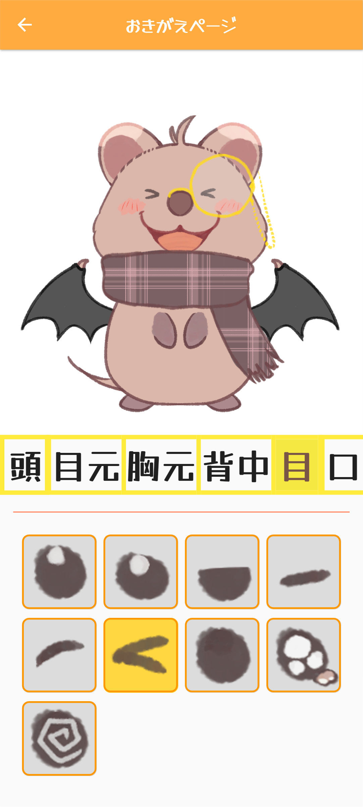

# アプリ概要 #
手描きクアッカワラビーの癒し系アプリです！ 
クアッカワラビーの着せ替えや食べ物抽選などができます。 
何かしらの生き物のアプリを作りたいと思って、妹にテキトーに動物を呟いてもらったのがクアッカワラビーだったのでこうなりました☻ 

## ●ホーム画面 ##
・「回す!」ボタンで食べ物抽選+ランダムで装飾がつきます。 
・「おきがえ」ボタンで着せ替え画面へ。 
・クアッカワラビー画像をタップするとちょっとしたアニメーションが出てきます。(場所によって全3通り) 
・「?」ボタンで上記のような説明が出てきます。 

    

 

## ●抽選結果画面 ##
ホーム画面で「回す!」ボタンを押した時の遷移後の画面です！ 
食べ物抽選+ランダムで装飾がつきます。装飾を含めない32通りのうち当たりは4通り、装飾も含めると全約40000通りです多分。 

    

 

## ●着せ替え画面 ##
ホーム画面で「おきがえ」ボタンを押した時の遷移後の画面です！ 
クアッカワラビーの着せ替えと表情変更ができます。頭・目元・胸元・背中・目・口パーツがあります。真ん中のバーで部位切り替えができます。 

    

  

# 環境 #
・**Flutter** 3.13.6 
・**OS** Windows10  

# 設計方針 #
そんなに規模が大きくないので、あまりクラス分けたりしてないです…画像を使うところはImage.asset()を用いています。 
・main.dart：ホーム画面 
・roulette.dart：ルーレット表示と「回す!」ボタン 
・result.dart：抽選結果画面 
・fashion.dart：着せ替え画面  

# 工夫したところ #
・ホーム画面にポップアップつけてみたこと。 
・抽選でただランダムなだけだと物足りないと思い、レア枠を作ったこと。 
・着せ替え画面のデザインを個人的よく見る感じにしたこと。また色の構成を橙や黄にして統一感を持たせようとしたこと。 
・クアッカワラビーや着せ替えアイテムの作画をなるべくシンプルかつかわいくしようとしたこと。